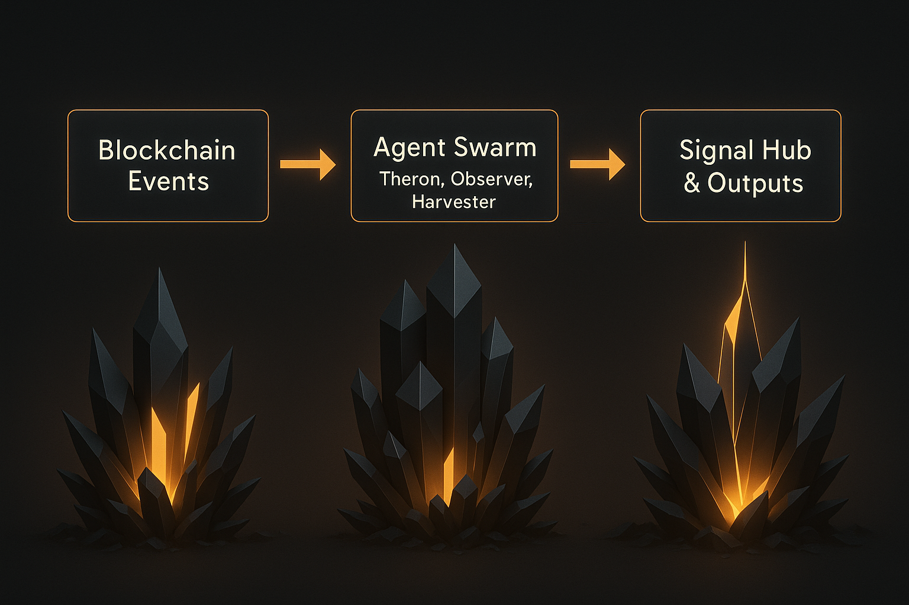

# Eremos Architecture


Eremos is a swarm-style agent framework for passive blockchain observation, designed with a modular architecture that enables scalable blockchain monitoring and signal detection.

## 🏗️ System Overview

The Eremos architecture follows a three-tier design pattern:

1. **Blockchain Events Layer** - Raw blockchain data and events
2. **Agent Swarm Layer** - Distributed intelligence processing
3. **Signal Hub Layer** - Centralized output and coordination

## 🤖 Agent Architecture

Each agent in the swarm:
- Has a specific role (`observer`, `memory`, `trigger`, `+ more to come`)
- Watches a specific event type or pattern
- Emits structured signals with confidence scores
- Optionally stores and manages memory
- Operates independently with shared utilities

## 🔄 Data Flow



```
Blockchain Events → Agent Swarm → Individual Agents → Signal Hub → Outputs
```

- **Input**: Raw blockchain events and transactions
- **Processing**: Distributed across specialized agents
- **Output**: Structured signals with metadata and confidence scores

## 🛠️ Technical Design

- **Shared utilities and types** define common structure across agents
- **Signals are deterministic and lightweight** — not reactive
- **Memory systems** allow agents to maintain state and context
- **Confidence scoring** provides reliability metrics for each signal

## 🚀 Future Enhancements

> Agent communication and orchestration are coming soon.
> 
> Planned features include:
> - Inter-agent communication protocols
> - Dynamic agent scaling
> - Advanced memory sharing
> - Real-time coordination systems
